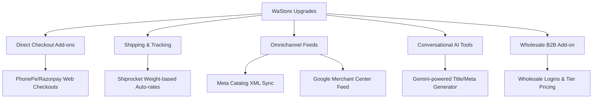

# Competitor Analysis & Strategic Recommendation: WaStore vs. Pygmy Commerce

Pygmy Commerce ([pygmy.app](https://pygmy.app/home)) is a modern, zero-commission eCommerce SaaS platform designed for Indian SMBs. By analyzing every corner of their website, we have dissected their offerings, pricing, and system architectures to outline how we can improve our WhatsApp-focused online store (**WaStore**) to compete with and surpass them.

---

## 1. Executive Summary

While **WaStore** operates as an agile, WhatsApp-based shopping cart designed for conversational commerce, **Pygmy Commerce** acts as a lightweight standalone eCommerce store builder (similar to Shopify) customized for the Indian market. They offer direct shipping integrations, Indian payment gateways with one-click checkout, catalog syncing for social ads, offline POS capabilities, and specialized merchant tools.

To compete head-to-head, we do not need to abandon the WhatsApp-first model. Instead, we should **combine the high conversion of WhatsApp conversations with the automation of standard eCommerce** (payments, shipping, feeds, AI copywriting).

---

## 2. Competitor Feature Breakdown

### A. Storefront & Catalog Management
*   **Zero Commission:** High marketing focus on keeping 100% of profits, charging only a flat monthly/yearly SaaS subscription (₹9,588/year or ₹799/month).
*   **Industry-Tailored Themes:** Custom landing layouts optimized for specific Indian sectors (Sarees & Fashion, Organic & Naturals, Jewels, Electronics, Food & Groceries).
*   **Real-time Inventory & Stock Tracking:** Prevents overselling, automates out-of-stock notices, and manages variant properties (size, color, weight) dynamically.
*   **AI Store Assistant (Gemini API):** Integrates Gemini AI to automatically generate SEO-optimized product titles, description copies, keywords, and search tags.

### B. Checkout, Payments & Shipping (Indian Context)
*   **Integrated Payments:** Built-in gateways for UPI, cards, and net banking using **Razorpay** and **PhonePe**.
*   **Frictionless One-Click Checkout:** PhonePe checkout integration for instant address autofill and transaction completion.
*   **Logistics Connectors:** Pre-integrated with **Shiprocket** (20+ carriers, 24k+ pin codes) and **Delhivery** (real-time tracking, automated label printing, COD support, cash-on-delivery handling).
*   **Manual & Auto Shipping Rules:** Dynamic shipping cost calculator by zone, package weight, or minimum order threshold (e.g., *Free shipping above ₹X*).

### C. Marketing & Channel Integrations
*   **Meta Catalog Sync (FB/IG Shops):** Generates automated XML product feeds to sync store catalogs directly with Meta Commerce Manager for dynamic ads and Instagram shopping.
*   **Google Merchant Center Feed:** Automated sync with Google Shopping to show products in local organic search and Performance Max ad campaigns.
*   **Abandoned Cart Recovery:** Captures lost checkouts and fires automated recovery templates via **WhatsApp** and **Email** in real-time.
*   **SEO-Ready Blog Engine:** Fully integrated blogging system designed to rank on Google and funnel readers directly to product pages.

### D. Advanced Modules
*   **B2B Wholesaling Portal:** A private portal allowing wholesale buyers to log in, view dynamic pricing tiers (wholesaler, retailer, distributor), manage credit limits, and place bulk orders.
*   **Reseller Module:** Allows third-party affiliate resellers to market products under their own custom branded sub-shops, syncing inventory from the primary brand.
*   **Offline POS Billing:** Enables store owners to key in offline customer purchases and generate GST invoices on the fly, syncing unified retail stock.

---

## 3. Head-to-Head Comparison

| Feature Category | Pygmy Commerce (pygmy.app) | WaStore (Current State) | Improvement Opportunity |
| :--- | :--- | :--- | :--- |
| **Primary Channel** | Web Browser / Mobile App Storefront | Web Browser -> WhatsApp Direct Chat | Keep WhatsApp checkouts but offer an optional **direct pay/ship checkout**. |
| **Checkout Flow** | 1-Click Pay (PhonePe / Razorpay) | WhatsApp URL API (`wa.me`) text message | Integrate **Razorpay / PhonePe** directly on the storefront for instant booking. |
| **Shipping & Logistics** | Shiprocket & Delhivery (Auto-tracking, label printing) | Manual coordination | Build a **Shiprocket Add-on** to compute shipping rates and push labels automatically. |
| **AI Integration** | Gemini AI product tags & descriptions | None | Add a **Gemini Content Builder** inside `WaProductList` admin console. |
| **Ad Channels** | Auto-feed to Meta Catalog & Google Shopping | Manual product setup | Build a **Facebook & Google XML feed generator** dynamically. |
| **B2B wholesaling** | Portal, pricing tiers, credit limits | None | Create a **B2B Wholesale Module Add-on** for bulk clients. |
| **Growth/Referrals** | standard discount coupons | Referrals page with mobile design | Enhance **Referral rewards** to drive viral WaStore invites. |
| **Offline Retail** | POS Billing & GST Invoice printer | Online storefront only | Add an **Offline Order Form** inside the dashboard. |

---

## 4. Where WaStore Can Improve & Excel

To zoom past Pygmy Commerce, we should capitalize on our **WhatsApp CRM and Flowbot capabilities**. Pygmy lacks direct, deep conversational automations. We can integrate our storefront directly with WhatsApp bots:

1.  **Dual Checkout Modes:** Provide a toggle in settings:
    *   *Conversational Mode:* Checkout via WhatsApp chat (current).
    *   *Express Checkout Mode:* Pay directly on the website via integrated UPI/Razorpay, then notify both parties on WhatsApp automatically.
2.  **Interactive WhatsApp Cart (Flows):** Build a FlowBot template where customers can browse catalog collections, select items, and pay **entirely inside WhatsApp** using WhatsApp Flows, syncing back with the WaStore database.
3.  **WhatsApp-First Cart Recovery:** Since we already have active WhatsApp Cloud API numbers, we can track when a customer adds items to a cart but does not click checkout, then **automatically trigger a WhatsApp Flowbot notification with a coupon code** after 30 minutes.

---

## 5. Strategic Implementation Plan for WaStore

To implement these updates, we can divide the work into components and sell them as **Marketplace Add-ons** or premium subscription features within the WhatsApp CRM dashboard:



### Phase 1: High-Converting Payments & Shipping Add-ons
*   **Razorpay/PhonePe API Integration:** Add fields in settings for `paymentGatewayApiKey` and `paymentGatewayProvider`. If enabled, the React checkout drawer (`PublicWaStore.jsx`) displays UPI/Card fields.
*   **Shiprocket Integration:** Allow merchants to specify default warehouse pin code, average packet weight, and dimensions. Use the Shiprocket API to calculate exact delivery costs and generate labels upon order completion.

### Phase 2: Ominichannel Feeds & Ads Connectors
*   **Dynamic XML/JSON Feed Routes:** Expose public endpoints like `/api/wastore/feeds/meta/:slug` and `/api/wastore/feeds/google/:slug` which read products from `WaProduct` and output them in XML RSS format for FB Commerce Manager and Google Merchant Center.

### Phase 3: Conversational AI Content Copilot
*   **Gemini Description Builder:** Add a "Generate with AI" button in the admin interface (`WaProductList.jsx`). When clicked, it calls a backend route querying Gemini API with parameters `{ name, category, tone }` to generate high-converting SEO descriptions and search keywords.

### Phase 4: B2B Wholesaler Extensions
*   **Wholesale Pricing Table:** Modify the `WaProduct` schema to hold a `wholesaleTiers` field (JSON):
    ```json
    [
      { "minQty": 10, "price": 450.00 },
      { "minQty": 50, "price": 400.00 }
    ]
    ```
*   **B2B Client Logins:** Create a simple checkbox in store configuration to allow wholesale login portals.

---

## 6. Developer Analysis of the Database Schema Changes

To support these changes without breaking existing functionality (following global rules), we propose the following schema additions:

### `WaStore` Model Extensions
We can add these fields in [WaStore.js](file:///J:/New%20folder%20(2)/Bitslab/backup%20of%20whatsapp%20cloud%2019-05-2026/Whatsapp%20cloud/server/models/WaStore.js):
*   `checkoutType`: Enum (`'whatsapp'`, `'gateway'`, `'hybrid'`). Default is `'whatsapp'`.
*   `paymentProvider`: String (e.g., `'phonepe'`, `'razorpay'`, `'none'`).
*   `paymentKeys`: JSON containing API keys (encrypted).
*   `shippingProvider`: String (e.g., `'shiprocket'`, `'manual'`).
*   `shippingKeys`: JSON containing credentials.
*   `shippingRules`: JSON containing tier rules (e.g. *Free shipping above ₹X*).
*   `isB2BEnabled`: Boolean. Default `false`.

### `WaProduct` Model Extensions
We can add these fields in [WaProduct.js](file:///J:/New%20folder%20(2)/Bitslab/backup%20of%20whatsapp%20cloud%2019-05-2026/Whatsapp%20cloud/server/models/WaProduct.js):
*   `sku`: String.
*   `stockQuantity`: Integer.
*   `trackInventory`: Boolean. Default `false`.
*   `weight`: Decimal (for shipping rates).
*   `seoMeta`: JSON (`{ metaTitle, metaDescription, keywords }`).
*   `wholesalePrices`: JSON (for tier pricing).
